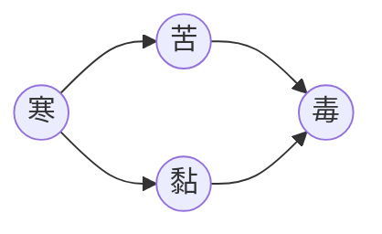
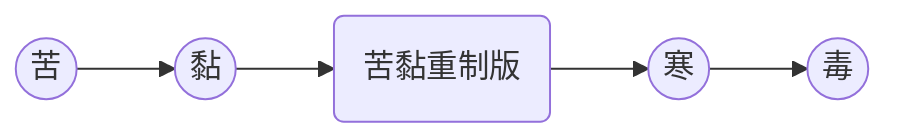



# 苦黏寒毒*系列游戏*


**苦黏寒毒**是一个系列文字冒险游戏。全部剧本由 **[[KCN杏仁]]** 完成。包含**《苦》《黏》《寒》**和**《毒》**。

原版与**《苦&黏》重制版**的不同点在于：

1. 重制版使用 **[[Zoharwolf]]** 的美术风格，程序由 **[[Zoharwolf]]** 编写。
2. 原版《黏》有独占CG，在重制版的相同剧情位置没有CG。

## 下载

本游戏支持 Windows。

Android 系统需要使用 吉里吉里模拟器 运行。

苦黏重制版由于游戏引擎问题，已知仅支持在 Windows 运行。（在 Linux 中使用 Wine 或许可以运行）



|            | 发布时间  |  大小 |          下载          |
| ---------- | :-------: | ----: | :--------------------: |
| 苦         | 2013-2-14 |  89 M |     [下载][bscp_1]     |
| 黏         | 2015-2-14 |  36 M |     [下载][bscp_2]     |
| 苦黏重制版 | 2015-6-16 | 135 M | [下载][bscp_zoharwolf] |
| 寒         | 2016-8-30 |  78 M |     [下载][bscp_3]     |
| 毒         | 2018-9-24 | 160 M |     [下载][bscp_4]     |

|                    | Size | CRC32    | SHA-1                                    |
| ------------------ | ---: | :------- | :--------------------------------------- |
| bscp_1.zip         |   89 | 4915BA5E | B076CC3D5B158044211A68F61F7BC8428DCA7DA5 |
| bscp_2.zip         |   36 | E3A89494 | 55C1E6A8CF9DA462CB2C4AC6D54FB0D1C527E4DC |
| bscp_3.zip         |   78 | FC3BFE68 | 66517F57582EFB1EC742A748146A33F5D5DAADD6 |
| bscp_4.zip         |  160 | EBD955B6 | DE382E510A23EBD7425CE6C591597815800B9016 |
| bscp_zoharwolf.zip |  135 | 9011D1B1 | 0B0840CAE4188BDAC97DA7310DCFAA4554D84F0D |



## 故事与角色梗概

### 故事线

《苦黏寒毒》讲述了七相、凌子、焦雨和年年的情感历程。

前三个故事均讲述其中两位角色之间的经历，并在《毒》将所有角色汇集，给玩家五味杂陈的阅读和游玩体验。

剧情时间线：

游戏发布时间线：

### 七相


犬兽人，警察，常在咖啡店喝冰咖啡。焦雨曾是他的授课教师。



### 凌子


狮子兽人，***`警察局长之子`***。习惯混迹街头和吸烟，经常因为犯事而成为警局常客。



### 焦雨


犬兽人，警察，厨艺很好。毛发从小就很茂密，冬天即使不穿什么衣服也不会觉得冷。他一直从心底里意识到温暖别人是他应该做的。

#### 主创访谈

LEORChn：关于焦雨的身份是 先毒贩后警察 还是 先警察后毒贩？

KCN杏仁：***`我没有明说，但通常来说肯定是先警察的`***



### 年年



全身洁白的狐兽人，管理着一家旅馆。***`艾滋病患者`***。

### 咖啡店老板

冷门咖啡店的店长。七相在《毒》中被调遣到另一城市之前，经常去他的店里喝咖啡。

### 警察局长

狮子兽人。***`凌子的父亲`***。在《毒》中七相调遣到另一城市后的上司。

## 相关作品







## 制作人员

### 《苦》原版

{:no-thead=""}

|                  |                                     |
| ---------------- | ----------------------------------- |
| 剧本、脚本、立绘 | [[KCN杏仁]]                         |
| 音乐             | IB 海猫鸣泣之时 K 炼狱庭园 |

### 《黏》原版

{:no-thead=""}

|                  |                                                              |
| ---------------- | ------------------------------------------------------------ |
| 剧本、脚本、立绘 | [[KCN杏仁]]                                                  |
| CG               | [[ARoung]]                                                   |
| 音乐             | Sentive                                                      |
| 特别感谢         | 嘎嘎土狼犬 COOKIZI [[狼崽棕毛]]<i style="color:#888">（小崽崽狼）</i> 漠狼 |

### 《苦&黏》重制版

{:no-thead=""}

|            |                                                              |
| ---------- | ------------------------------------------------------------ |
| 剧本       | [[KCN杏仁]]                                                  |
| 程序、立绘 | [[匈魔剑]]                                                   |
| 音乐       | Sentive 炼狱庭园 魔王魂                                |
| 客串       | AISP 嘎嘎土狼犬 [[克里修麦德]] [[亚罗神虎]] 凯洛 [[倏尔破晓]] [[Suntik]] |



### 《寒》

{:no-thead=""}

|            |              |
| ---------- | ------------ |
| 剧本、脚本 | [[KCN杏仁]]  |
| 立绘       | 水饺猫       |
| 音乐       | [[毛绒虎爪]] |

### 《毒》

{:no-thead=""}

|            |              |
| ---------- | ------------ |
| 剧本、脚本 | [[KCN杏仁]]  |
| 立绘       | 薄荷         |
| 音乐       | [[毛绒虎爪]] |

[bscp_1]: https://github.com/LEORChn/ContentDelivery/releases/download/Game/bscp_1.zip
[bscp_2]: https://github.com/LEORChn/ContentDelivery/releases/download/Game/bscp_2.zip
[bscp_3]: https://github.com/LEORChn/ContentDelivery/releases/download/Game/bscp_3.zip
[bscp_4]: https://github.com/LEORChn/ContentDelivery/releases/download/Game/bscp_4.zip
[bscp_zoharwolf]: https://github.com/LEORChn/ContentDelivery/releases/download/Game/bscp_zoharwolf.zip
