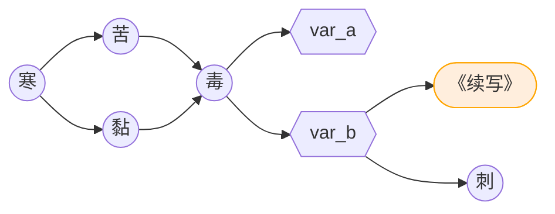

# 《苦黏寒毒》续写

作者：亓官 2019年5月2日 

 [查看原文](https://tieba.baidu.com/p/6119543959)

## 导言
在下亓官，又逢五一小长假，在下虽然并没有放假，但是晚自习提前一小时下课（从10:30提前到9:30）着实是写写渣文的好机会~
镇楼图是昨天摸哒，比较粗糙，背景也直接用了照片QWQ见谅。

四部曲的话，大家就算没有玩过也应该看过或者听说过，可谓部部皆刀。感想什么的，太多人发表过，玩完了真的很难受，其它的在下不说什么其他的了。（笑）

焦雨的...那个结局...我感觉没什么可以续写的余地了QwQ（说出来都心疼）所以在下续写的是七相放焦雨离开的结局的后续。杏仁大大对能否续写应该没表过态，不过在下倒是没见过哪个大佬有续写过QwQ(毕竟是萌新）

如有侵犯，自当删除！



这大概是短篇？其实如果有兽想看，也可以一直更下去。全篇仍然以七相视角叙事。时间跨度与原作有一些远，人物性格的把握在下自然做不到与原来一致，看不下去或者OOC了，想走就走吧，想喷就喷吧～在下准备好啦QWQ。

忘记剧情或者细节的吧友可以去看看《毒》再来看文。（说得好像有谁来看似的）想重温四部曲也是可以的（你是魔鬼吗？？？）

时间跨度离焦雨被放走，有十年左右，中间发生的焦雨和年年的事情会作为插叙或者番外的形式写出来。结局有好多好多种，（滑稽）在下在这个帖子里面只写一种以及附带的小番外，其他的结局和番外有可能会再开一个帖子全部收集……以免使这边太杂乱。（兴奋）毕竟不像玩AVG，可以存档重新选择。（纠结）

## 开始

上接《毒》：对自己开枪。

在家静养了几个月，手臂的伤已经痊愈得差不多了。母亲刚接我回来时，为此哭过好几次，我心里很不是滋味......凌子每天都打电话过来，询问我的情况，语气满是关切。中间他也曾来看过几次，只是时间都不太长，好像凌子也很忙的样子......

一切都会恢复了井井有条的宁静，仿佛我的生命中，没有出现过他一般，和那次一样，又一次，消失得无影无踪......

正愁着未来的工作之时，和凌子商量着可否先去咖啡馆工作。这时他才告诉我，我提交的辞呈并没有被批准......大约又有新的案件人手安排不过来了？这个社会还真是不安！我不知道该不该高兴，即使掌握着从他那里学会的种种技能，我深知我不是当刑警的料。但上级的安排不得不服从，父母也并没有很反对的样子。那么，以这件事为前车之鉴，我得让我的内心强大起来！

回到局里，除了更忙碌了，一切如旧。凌子一如既往的开朗热情，而那件事也加重了他对这一事业的无望，以致于帮忙都更不情愿了。凌子对我们之间的事情也不加掩饰，局里几乎无人不知了，局长自然也管不了什么，倒显出一副有所期许的态度？！

的确是一个很棘手的案件，专案组成立了一个星期，几乎没什么进展。可笑的是，我加入之后，竟然发现了一个十分有价值的线索，打破了瓶颈取得重大突破......简直和那件事一样，突破得让自己都猝不及防。

主犯被捕后，此案渐渐从同事的讨论中隐退，我得到了表彰。碰巧的幸运没什么可以炫耀的。之后发生的大大小小的案件，小则几周，大则数月。随着这些事情的解决，我的职位一直稳中求进的上升着，从组员到组长，从代理到任职......一晃过去了好多年，现在的我已经高出焦雨的原职不少了。其实局里的生活没有什么年月的概念，用案子来计算要准确的多......虽说凡事都处理得小心谨慎，尽善尽美，这一切都未免过于顺利了些？？当然，这不乏凌子与我关系的微妙作用吧，但我免不了对自己存疑。现在的我已经很少在一线出面了，大多都是召开专案组研讨会，处理文件提案，或者出差参加什么可有可无的会议.....说得好听些，离危险更遥远了，那哪有什么警察的样子？然上层的水深火热，让我不得不更加努力，不求表现得多么优秀，但至少要努力让自己不显得差劲。

凌晨三时，独自驾车在大路上驰行，雪飘扬着，路上空无一物。 
又要出差了，是省外的一个城市。多年之前，这里破获一场巨案，牵涉多个省市，也包括了我市。听闻有内部人员的帮助，具体我并不太清楚，只记得局长为此出差了一个月之久，过于突然，没有留下安排。那时我只是科长，却也忙得晕头转向的，几乎没什么时间陪凌子。凌子那时的支持着实给了我很大的力量，但事后他又总像个小孩子一样埋怨。令人哭笑不得的可爱，不过，很暖心就是了。

出了城，宽阔的国道更加空旷。
不时条件反射的看着副驾驶，空空如也——凌子没有一同来。
情人节过去好几天了，原指望一起过，送送礼物什么的，毕竟结婚还是不合法的，关系也已经说不清了。可惜凌子先被安排了其他任务，走得比我还早几天，我没有机会一道去，现在又值我在外出差......我希望这会是唯一的一次！

车窗外寒风凛冽，裹挟着攒聚着的大片雪花击打着挡风玻璃。说这像心碎的声音，会不会更加生动？
暖风从网格中吹出来，隔绝了寒冷的呼啸，它尽力保持着我四肢的温度，却无法让我的心再温暖些。
啊！又是可怕的独处！我已经习惯了凌子的陪伴，每次独处，总是忍不住追溯……

巧克力是好东西，即使你拆开了他，放了许久，或者是不管它，过了保质期，只要你把它放对了位置，它都不会有什么变化，闻起来依然香甜，吃起来毒性不减......
就像——死去的爱情，放在心里，永远不会彻底......

又想起他了，那个时候的他。我叹口气，将车速减到几乎停下来，凝望窗外的雪，纷纷扬扬冗冗杂杂地斜飞着，几乎成了一道皑皑的幕，望眼欲穿。
依照局里的领导的意思，这次出差回来再过段时间，我就该领副局长的职了。凌子是知道的。他表面上一副事不关己的的样子，但一想到我会多么忙碌、劳累，心里也是不愿的吧。但他只会给我支持，和一点小小埋怨，仅此而已，他就是一直如此迁就我，如此让我依靠......

视线重新聚焦，枯树，麦田，远处的山头，前方的路，无一不是茫茫的白。大约除了灰蒙蒙的天和广袤原野上移动着的不和谐的黑点，无不是白色。重新提速，雪的落迹愈发向后倾斜了，有多少是风的功劳？
可惜再快，那一切都无法随风而逝，即使他冷暖的温存被冲洗得寡淡，他伫立的身影被侵蚀得模糊，心不是依然会，隐隐作痛吗？
我无力地握着方向盘，保持着车向，不知道过了多少个小时，风雪渐渐抛在了车后，绵延的灰云终于不再遮蔽。原以为阳光会让我的心情好一些，但这晦明让我感到目眩。恍惚之中，远处的路旁，好像有一只兽在扫着雪。这是几小时以来遇见的第一个生命。我一直盯着，放慢车速，看着他由一个缓慢移动的棕色小点变近，变大，变清晰，变得有辨识度，变得让我熟悉、疑惑、又无比恐惧，变得像一只兽，变得像他......变成了他！
“假的！”我在车里对着空气怒吼一声，眼泪却开始充盈。我的双臂僵在方向盘上，腿使不上劲，脱力地松开了油门，没有动力的车在雪上滑了十几米。他向这边望了一眼，便转头扫雪了，我只感觉大脑一片空白，此刻的每一次心跳都疼痛无比......

打开车门的一瞬，冷风把我带回了那天。踏上雪，我清晰地感知着手脚温度的骤降，几乎又要僵住。他再次转头，看见了我，凝固在了原地，目光中诉说的无数话语，复杂得一言难尽。但这其中，无论是身为教官的威严，还是作为伴侣的狡黠，都荡然无存......他已经不再是那时的他了......
我们伫立在风里，谁都没有勇气踏出第一步。
隆冬，这座城更北，也更冷...制服向来无用，风灌进来，一丝温度也没有留下......

忽然他变了神色，丢下铁锹，向我这边走来，平静得不得了。我也故作镇定地迎上去，才发现他只穿了件薄的旧夹克。姿态，动作，深不可测的眸，都像以往，但我觉得，那是认出我以后佯装出来的。
“......小七？”他熟悉的声音和风灌入我的双耳，让我觉得耳边嗡嗡作响，几乎窒息。我这才猛地意识到，那个又一次消失了的焦雨，消失了十年的焦雨，已经赫然出现在我的面前......
“焦...焦雨......你不冷吗？”我完全不知道从何处说起，千言万语却只憋出了这句最没用的。
焦雨竟然露出了一副狡黠的样子，熟悉又讨厌，“怎么，你依旧那么不禁风雪么？”
“那也不用你管！你不也一样口不饶人？”我怼了回去，丝毫没有怒意。能这么和我开玩笑的，能这样叫我名字的，越来越少了...恐怕等我出差回去之后，只有局长和凌子会这样吧......
焦雨马上恢复到了之前平静的样子，看向一边，长叹一声，一片白雾消散在冷风中，“大概，这种样子的我，现在也只有你能看见了......”焦雨脸上写满了沧桑。果然是装出来的吗？说实话，他这样子让我一点也不习惯，甚至有些酸楚。
\-
我们都沉默了很久，直到一阵强风席卷，我不自觉地抱住了自己的双臂，看向正望着我的焦雨，又猛地放下来。若是那时，在他面前这样，估计又要被嘲讽一番。他只无言，走上前，用一只手托起了我的双手。温暖如火，不减当年，和那天的感觉简直......可惜，心境已经完全不同了......
寒风和勇气终于推了我一把，我抱了上去，紧紧地，重温这炉火一般的暖。头埋在焦雨的胸口，不争气地让他的衣湿了一片......
我看不见焦雨的表情，至少，惊讶是会有的吧……
\-
“面对十年没见的朋友，别人可都是见面就会拥抱的，你倒是酝酿了好久啊。”我松开双臂，一副没听明白的样子望着他的脸，他轻轻揉着我的头发，“你还是，相当不主动啊......”语气没有嘲意，只有无奈。我仍然沉默，焦雨忽然把左手搭在我的肩头，顺着手臂滑下，滑过了肩章与警徽“......看你这样子，你是在继续任职，而且位子比那时的我高出了不少啊。现在...是在出差吧？”
“不错，很有刑警兼嫌疑人的洞察力！”我情绪平缓了许多，调侃地说着，等着焦雨的反应。
“现在已经轮到你嘲讽我了么？”焦雨面无表情，“现在的我既不是刑警也不是嫌疑人。我只是好奇你为什么仍在继续当刑警罢了......”
“我知道我不合适，可局里没有批准我的辞呈，我能怎么办？既然都选择了继续，那就坚持下来呗......”我无奈的说着。
焦雨沉默了一会，忽然问道：“因为凌子？”
“......不一定，或许吧。”
\-
“......那你可真行。”我感觉焦雨可能误会了什么，但辩驳已经不重要了。我们的视线从对方身上移开，不约而同地望向公路的尽头。前方的积雪被铲过了，把世界分成了两半，那都是焦雨清扫的吗？
正想问，焦雨却自顾自地说起话了，“说真的，那一天，你追上来，你的枪口指着我的时候，我已经不抱希望了。我想过了很多可能。被你打伤带走，或者被你枪杀......独独没有想到......”
“原来我在你眼里有那么狠么？”
“其实你如果一定要抓的话，我十有八九会自杀......不过就算这样，你也应该有什么顾虑。但你还是放了我们离开。所以说，你那个时候一点作为刑警的觉悟都没有，你就不是个当刑警的料嘛！”
“你特么，放了你一马还这么多废话！”我知道焦雨这些话没有嘲讽的意思，他就是这样的，能把感激的话说得像挖苦。我忽然用手肘给了焦雨一个肘击，他吃痛地后退了半步，然而我已经别住了他的小腿，稍一用力，焦雨便倒下去了，他躺倒在雪地上，就像那个傍晚。
“不是当刑警的料是吧！叫爸爸！”我大笑，在他的身边坐下来，笑着，笑着，又湿了眼睛......
还好，焦雨看不到。

“你...后悔吗？”焦雨在雪地上一动不动，仰望天空，他说得很轻，很缓，像是没有底气问出来一样。
又是这个熟悉的问题，我的答案也从来没有变过——“不后悔。从来没有。”即使你对我无端地试探，欲擒故纵地冷落，那样悄无声息地离去，一次，又一次，我都不曾后悔，“你也曾是我发誓想要在一起的人啊！”不知怎么，忽然就把心中的话说了出来......
“可惜，只是曾经......”焦雨叹口气，看向了我，他的目光灼烧着我尴尬的脸，“...我们的选择，都没有什么错，谁也不能怪谁......小七，凌子对你很好吧？”焦雨突然转移话题，气氛不那么尴尬了。
“凌子真的很好，这么多年，如果没有他的陪伴和支持，我可能早就如你所说的离职了，那工作的重压真让人活不下去。”
“所以其实没有我，你也可以活得好好的咯？”他居然笑了起来。
“我...我不是那个意思好吧！焦雨你有毒吧！明明...明明是你先问的，我...”我忽然就语无伦次了。
“哈，看你着急的样子，真像回到了过去！小七，你别误会，这样我的目的就达到了，就像我第一次离开你一样，越决绝，给你留下的痛苦与折磨就会越少吧...你不认同吗？”焦雨坐了起来，和我对视着。
“可你还不够决绝！每次看到那块冰冷的东西，都令我，苦不堪言......”
“难道，你希望我在你面前把它摔得粉碎，还是其它恶劣的处理方式？如果我留着，就像没画上句号一样，只会让你，更加容易抱有幻想吧。”焦雨一字一句的说着，说得彻头彻尾。
我无言，无话可说，无力反驳。他是对的，这或许的确是，最好的处理方式了......又是一阵长久的缄默。
\-
“焦雨，说真的，我想好好谢谢你。你让我体会了，明白了很多很多，很多几乎不可能出现在我生命中的种种，你给了我机会经历，让我的内心更加强大，也让我的工作能力有提升......还有凌子，他现在对于我的分量，和那时的你相比，”
“我希望更重些。小七，我没有你说的那般好，那时大约显得稍微成熟了些，但还远远不够。一念之差，这一念的差别真的太大了。我也曾想，如果我仅仅是一个教官，没有背后的种种，会有多大不同呢？终究只能想想...”焦雨长叹，风吹拂着他深棕色的发，也吹拂着他迷离的眼神......“现在，你和凌子，有新的生活，多好啊......我和凌子很早就打交道了，我知道，凌子他很好，所以小七不要辜负了凌子，知道吗？”
“我又不会像你那样玩失踪！”
“少贫了......“焦雨忽然看向我，他眼中闪烁着些光芒，”...嗯...小七，你，能和我一起去看看年年吗？”焦雨挤出一个微笑，阳光打在他的脸上，显得平静而令人心安...
\-
“行啊！走吧，上车！在这里要冻死了！”我赶紧上了车，焦雨则小跑到他原先铲雪的地方，带了铁锹来，在后备箱摆弄了一会儿，上了车对我说：“太长了，后备箱关不上了，抱歉...前面不远处是哨站，我得把锹还回去，麻烦你了。”
“小事！”我看着坐在副驾驶的焦雨拉出安全带别上，发车开始加速，“说真的，焦雨，我很不习惯你那样说话，像是，在求我一样......说到底，就算我经济独立了，成熟了，甚至职位高过你了，但是我还是会不自觉地把你当做老师，或是...上级......所以，你能不那样说话么？...至少对我......”
“但我本来就是在求你啊。难道我应该命令你送我过去，以一个老师或上级的身份？所以，到底，我果然本就无法成为你命中的他，就因为身份，是么？”
“不是，焦雨，我只是觉得，”
“这不是真正的我？”焦雨忽然接话，正是我想说的。
“...嗯...”
“怎么说呢，这都是我的不同面罢了，你有幸看到了我的狡黠，总不能将我的其他面都判为虚假吧。”焦雨像是在给孩子讲大道理一样...
“...对不起...”我声如蚊鸣...
“道什么歉，喏，前面就是了！”焦雨指了指右方，给了我一个温暖的笑。
\-
在焦雨面前，我什么时候不是个孩子呢？

    
插叙预告

    明天在下要出发去武汉，后天在洪山区考试QAQ，抱歉不能更新<(_ _)>
不过这里提前说一下要写的刀子（嘿嘿虽然后续没有名字，但是刀子是有名字的）《幻影》《他会喜欢的》《别担心》《这一次，会是多久？》以及《十年》的中长篇系列（讲述这之间十年的故事，主要是焦雨和年年）

    2019-05-10 13:09

---

会喜欢的

一.
焦雨不再说话，他打开信封数了数，像是预算着什么。
过了一个收费站，大抵正式入城了，焦雨一直看着窗外，不知道是在观察着什么…房屋渐渐多了起来，路上的车与兽也是，算不上熙攘，却也不寥寥。
经过一段繁华的街区，大片的阳光被楼壁的玻璃晃进了车里，弄得我有些缭乱。这个路口，焦雨让我左转。
转过来不久，我们停在了路边，焦雨说不远处有家花店。推开车门好像就嗅到一丝冷香，在冰雪上飘渺着，又不曾消散。
“你来过？”我忽然问着，赶上走在前面的焦雨。
“没有。自首的路上偶然瞟见的。”焦雨脸上是直言不讳的平静。
“于是就记下来了？”我有些惊讶。
焦雨忽热回头看向刚才驶过的路，“…其实我也不敢确定，毕竟过了这么多年……”焦雨深呼吸，又缓缓呼出来，“但这下可以确定了。”他笑了笑，又继续向花店走去。
我们进了店，香气盈满鼻腔，从每一根神经与血管漫延开，让我的每一个细胞都愉悦舒畅起来。情人节已过，顾客并不多。焦雨挑了一大捧白色的玫瑰，抱在怀里，去柜台付了钱。
“为什么是白玫瑰啊？你不应该选……红色？”
“年年会喜欢的，他………喜欢白色。”焦雨又明朗地笑了。我喜欢他这样的笑，当然，现在，是作为朋友的喜欢。
“为什么不买些实际点的东西呢？比如水果或牛奶什么的？”我带着一半疑问，一半调侃的语气问他。
“不用啦。年年会喜欢的。”焦雨笑的很阳光，阳光得像在掩饰什么一般。
“好吧，我也不知道选什么颜色呢，多谢你告诉我咯……”我转了一圈，买了一捧白色的百合，下面铺陈着满天星做衬托，和焦雨的白玫瑰一样，洁白而芬芳。
焦雨拉我到了店外面，把玫瑰递给我抱着。我开始低头，端详着每一瓣花的轮廓，每一片叶的纹络，没注意焦雨已经捧着一捧白雪，走到了我跟前，双手举过了我的耳尖。
晶莹的雪水一滴滴从焦雨的掌缝间渗下来，打在洁白的花瓣上，散成无数小珠飞溅开，在冬阳下，就像钻石一般闪耀。我惊讶地抬头，目光又被滴下的钻石所吸引，一同碎裂在花间。我的花束也得到了同样的洗礼。
后来我流转的目光停在焦雨的脸庞，他一直是一丝不苟的神情，直到雪水不再顺着他的手缘的细毛滴下，也没有动过一下，就像……军训…
虽然我没有，但我为年年感到高兴，他得到了这样的焦雨。
将白玫瑰递还到焦雨怀中，我握住了他的手。没有我想象的那么冰冷，但毕竟刚化过雪，比我的手要冷得多……
焦雨惊讶的看着我，我付之一笑，“难得你的手比我冷，就算只是朋友，我主动一回，有什么好惊讶的？”
“小七……你真的…很特别……”他闭上眼，手掌没了力度，任我摩挲着他的指尖、掌心，任彼此的温度越来越近……
他这句曾经对我说过的话，让我意外的心安，那次也是，现在也是。
“说起来，我都快记不清年年的样子了，记忆中他瘦弱的身体，总让人忍不住想要去保护，你也是这样选择了他吧……焦雨？”
“是啊，我后来的选择，几乎都是。”焦雨似乎并没有惊讶于我“直白”的问，所以他也“直白”地答了。是啊，这么久，放下，不放下，已经说不清了，也不用说清了。我们心知肚明，心照不宣……
“年年一定会喜欢的，我们快去吧，多久没见了，真想重新好好看看呢！”我忽然激动地说着。
“小七……”
“嗯？”
“没事，走吧。”焦雨把花束小心地放在了后座，而后上了车，便又一言不发了……

二.
我对这座城市的路一无所知，每到路口，都会预先问焦雨，后面则几乎都是焦雨主动说的，有时甚至给出接连几个路口的方向，如同导航一般。
我不知道焦雨判断方向的方式，或许是标志性建筑或者路牌什么的，总之，是个让我无比佩服但想学也学不来的技能。
终点，旧的市医院，开着的大门，锈蚀的铁围栏，积雪的樟与松，车轮痕，鞋印，白，端庄，死一样的沉寂……
我抱了花束，向医院走去，焦雨却并没有跟上来，站在车边，看着我。
“焦雨，走啊。”我疑惑地问着。
焦雨沉默了一会，远远地我感觉他吸了吸鼻子。“……小七，是这边……”他又无言，抱着花束向公路对面走去。
绿灯很长，像是特为他陷入泥沼之中一样的步伐准备着的。我跟着他。两只抱着花束的兽，不难引起驻足与目光。
对面是一座公园样的地方，几圈整齐的高灌木围住了中间的广场，大概是铺满了砖块的那种，或者有个地内喷泉之类。但奇怪的是，这里一只兽也没有，甚至停车场里也没有一辆车。
焦雨的步伐越来越沉重，他停在分断开灌丛的砖路口，凝视着前方我目所不能及的地方……下一秒，他转头，微笑，眼泪流下，打在白玫瑰上，一滴，又一滴……
我知道，这是我第一次看见他流泪；但我不知道，这也是最后一次。
我不明白，为什么会这样。直到我站到焦雨的身边，直到我看着一列列整齐的碑矗立在眼前，我都不会明白…
我真傻……我早该想到……这两句话回荡在我的脑海，我完全站不稳了，向后仰坐到雪地上，花束压在我身上，滚落到雪面…
焦雨想扶起我，我却完全用不上力。他放弃了。
他缓缓向碑群中走去，像个生锈的机器，渐渐地我的视线模糊了，模糊中看到了焦雨弯下腰的身影，模糊中听着焦雨泣不成声的话语，模糊中彷佛又看到年年瘦弱的背影，他阳光的尾巴，他风雪中浮动的洁白的毛发……模糊了好久……
不知多久，我的身边落下了焦雨的声音…
“小七，谢谢你能来……对不起……”我只听清了这三句。
再回过神，周围已经空无一物，只剩我的花，我的车，我们到来的压痕……和混在其中的，他离开的踏痕……
一切都太突然，我的身体和思想像灌了铅一样运转不开。我听不见我嘶喊出的不，听不见我嘶喊出的他的名字，我跑得近乎疯狂，抓住他仅剩下来的一丝气息，顺着他仅留下来的一串步迹，疯狂地，疯狂地奔跑着。
街海茫茫，没有方向，十方皆白，十方皆暗……
当我再站定，在一个路口，狼狈地被来往的兽注视着，我不知道我在干什么。环顾四周，没有他，没有他的气息，没有他的步迹，我在流动的杂乱气息与无数杂乱步迹，迷失了……
我找不到回去的路，我也找不到他了……
下雪了，细细索索地落在我身上。我忽然记起来我身上的制服，臂上的警徽，明天的会议……我用四碎的心外强中干地挺起身体，寻着大致的方向摸索着回去的<s style="color:red">露</s>（路）……
在路上，我总回头，就像能够看到焦雨在某处注视着我一样……我知道这是自作多情……
回到公墓，已是深夜。车上积了很厚一层雪，地上的雪将我们的足迹遮掩得不留丝毫。我拖着疲惫的身体，走到曾经呆坐的路口，我的花束躺在那里，被雪埋葬了大半。拾起它，轻轻拂去能拂去的雪，我也像他一样，如生了锈的机器，一步，一步，走过一排排整齐的碑。
他的花束很显眼，纵使被雪埋了大半，我仍一眼看到那唯一有花束的碑。如释重负地，我对自己笑了笑，才发觉滚烫的泪早已纵横……
放好花束，我趴在雪上。雪在泪下化开，一个一个小坑渐渐连成一片。我的身体不再抽动，感觉背上的雪越积越多，感觉心很空，感觉好冷……好冷……
雪，埋葬我吧，遮盖我这制服的黑，只留洁白……
其实不必麻烦，我在这里，在雪里，在墓间，安眠，没有谁会发现……

三.
睁开眼，撑起身体，身上的雪崩解下去，顺着雪剥落的，还有一件夹克，是焦雨的。
“焦雨！”我猛地站起来，大喊着他的名字四望，什么兽都没有。头痛欲裂，天旋地转，我一个踉跄扑到了花束边，才发觉自己的双腿根本撑不起身体……
又走了，真的走了，无声无息。好像，除了一件夹克，我什么都不曾得到；好像，除了一束百合，我什么都不曾失去。
没事，我还有凌子。我可以这样安慰自己。可我还有年年这句话，焦雨已经不能说了，早就不能说了……
捧了把雪在脸上揉着，尝试使自己清醒些。看看腕表，快八点了，才想起昨天一天都没吃什么东西。十点的会议，我强迫自己去吃点什么，即使并不情愿。
我试着动了动僵硬的腿，站了起来，凝望了好久那碑上的简单文字。
“年年，再见了……”我忍住没让眼泪流下，拍净制服上的雪，捡起夹克，抖了抖，穿在了身上，仍然有些温暖……这余温，有多少是属于他的呢？
我挺起胸，严肃地向车走去。怎么说我也快要任职副局长了，不能显得软弱颓废。十点的会议，公务，案件，生活，凌子，都等着我呢！
所以说，自欺欺人，现在看来，也不算太差……

四.
几场秋雨过去，树叶受了很重的伤，汩汩地流着血，染红了一大片天地。雨中，一封信，没有发件址，悄然而至……
——
致小七，
我不怎么写信，很久前大都是写给母亲的。这大约是最后一封。我也不清楚这会在什么时候到你手中，但那时，我想我已经沉寂于某处了。不要为我伤心，也许并不会伤心，但我还是要说：
小七，对不起。
虽然你可能并不稀罕这一声对不起，但我所亏欠的，太多太多了，请接受它，好吗？
第一次离你而去，虽然我有那样冠冕的理由，让你相信我是为了让你放下。但真要说，我对你一丝一毫的念想都没有，我自己都觉得可笑……对不起，小七，我只道歉，你不必原谅。
十几年前，在警校里，我失去了你。九年前，在病床边，我失去了年年。去年的今天，我在监狱中，失去了我的母亲。抱过我的兽，都说我很温暖，第一个是母亲，第二个是你，最后一个，是年年。我们都曾相互拥有，如今，我什么也不剩了……
我想让年年看到下一个春，几乎花光了所有的积蓄，除了留给母亲的那些，我一分也没有留下。可冬天总是那么长，那么冷，那么难熬……年年他，还是没有等到春天的第一束花开……曾经的我常认为。他的快乐，甚至可以比生命更重要，但我错了……当他在我怀里紧抱着我，仿佛松开的下一秒就会死去一样时；当他全身疼痛，哭喊着冷与我的名字时；当我给不了他渴求的温暖与快乐时，我好难受，我真的好难受……
是我害了年年。每每回忆起那年春日的一个个和谐的午后，回忆起年年看着我微笑的脸，回忆起那一声，“谢谢你，我很开心。”我都心如刀绞……
我一直不敢问你，也没了机会问你，现在是最后的机会了，即使我听不到答案……那个深夜，久违地看见你发来的信息，久违地与你独处，我发现我竟是有些开心的。但我不知道，我已经死了。当你看着我在你面前温和的微笑时，我在你眼里，是陌生，是可怕，对吗？早在你问出最后那个足以结束我生命的问题之前，在你的心里，我已经死了，对吗？
年轻时我追求的激情，我追求的占有，在成熟之后变得苦涩，才发现我所希望的生活，只是想，想给需要我的温暖的我所爱的兽以温暖，给渴望我拥抱的我所爱的兽以拥抱而已。只是我已经不配去给予和拥有了，也没有机会去给予和拥有了……
和你分离之后，我迷失在自己的森林里，等待着能带我出去的那个他。我曾多么希望他还是你，但冥冥之中，我没有给你这个机会，也没有给我自己这个机会。
也许我们还会在相逢，但我们不会再，相逢了……
岁月漫长，我不值得你耗费仅剩的安宁、时间去等待，只希望你可以记住我，记住我这样活过，这样在你身边陪伴过……
最后，求你能替我看望年年，好吗？白色的花，他会喜欢的。如果你情愿，我还求你，取一捧他碑上的雪，无论投进<s style="color:red">那</s>（哪）一条河，都可以。我想，我的暖，也许，还有一点点，一点点作用……
我有些累了，小七。不说了……
焦雨

五.
我读了几天，几夜，不知道多少遍，没有一次是完整的……无论从何处开始，被文字与回忆刺穿身体的痛楚，都让我坚持不住……有些字，被我的或是他的泪，花掉了，但没关系。因为它们刻骨铭心……
请几天假，淋淋雨，同秋叶一起受伤，一起淌下流不尽的血……
你的暖，我不再需要……

六.
捧着雪，轻轻捏紧些，让它不会在风中散开，让它完整的没入水中……
你们拥抱了吗？焦雨，年年？
……
如果不是凌子在身后抱着我，我也想和你拥抱啊，焦雨。但为了凌子，为了你们，我会，好好活下去的。
谢谢……

---

“怎么说呢，这都是我的不同面罢了，你有幸看到了我的狡黠，总不能将我的其他面都判为虚假吧。”焦雨像是在给孩子讲大道理一样...
“...对不起...”我声如蚊鸣...
“道什么歉，喏，前面就是了！”焦雨指了指右方，给了我一个温暖的笑。
聊得激动，差点开过了头，但是看看表盘，我怔住了……
“二十公里，你特么叫不远处？焦雨……你是怎么……铲过来的？……”
“跑两个小时也差不多了……”焦雨看着前方，沉默了一会，“以往训练时，也没少让你们跑，权当锻炼吧。怎么，心疼了？”焦雨坏笑一下，那种熟悉的感觉袭来，我有些开心。
“鬼才心疼你，弄完了赶紧去看年年啊！”
“行行行。”随即焦雨下车，一会儿后备箱的门便重重关上了，我见他提着锹敲了门，把锹放在哨站门边。
门开了，是一位年迈的公山羊兽人，留着很长的胡子，和蔼地眯着眼。他们交流了一会，焦雨拿了个信封，就回来了。
“手上是什么？”我看着薄薄的信封，随口问着。
“你当我是犯人啊？工资啦……不多，也总好过没有……”焦雨一面别着安全带一面说。我发了车。
——
这边的路上依旧没有一点雪，大概没有最初的一层做基础，后面断断续续地，下再多的雪，也无法积攒起来。有的爱情，也是如此，庆幸我并没有那样的经历……
“这边也是你铲的？”我看着前面一成不变的路，无聊地问起来。
“也有他的功劳。”焦雨也只看着前面。
“……焦雨，你怎么做起这个了？”
“终于想起问我的事了呢。”
“爱说不说，少跟我贫了。”
他叹口气：“出来不久，没有地方愿意收呗。”苦笑一下，焦雨看了看信封，继续说着，“他很和善呢……结算的时候多给了两百……”
“你怎么知道？”我有些奇怪。
“刚刚算了算才知道的，不过……<s style="color:red">以</s>（已）经没机会感谢他了……”
“哦对了，什么刚出来，从哪里？”我**地问了他一句，简直像是没有经过大脑思考……
“监狱啊！非要我说出来么……”焦雨的语气还是很缓和，但我却可以感受到深刻的不情愿……
“啊！！抱歉……我以为你只是不干了脱身出来……不过想想也是……十年呢……”十年呢……我不敢想象这十年，焦雨和年年到底经历了什么，遭遇了什么……我也不敢去问……
“没事……”焦雨平静的脸，现在在我看来，不知道埋藏了多少苦楚……
——
焦雨不再说话，他打开信封数了数，像是预算着什么。
过了一个收费站，大抵正式入城了，焦雨一直看着窗外，不知道是在观察着什么…房屋渐渐多了起来，路上的车与兽也是，算不上熙攘，却也不寥寥。
经过一段繁华的街区，大片的阳光被楼壁的玻璃晃进了车里，弄得我有些缭乱。这个路口，焦雨让我左转。
转过来不久，我们停在了路边，焦雨说不远处有家花店。推开车门好像就嗅到一丝冷香，在冰雪上飘渺着，又不曾消散。
“你来过？”我忽然问着，赶上他。
“找工作的时候在路上看见的。”他笑了笑，脸上是直言不讳的平静。
——
我们进了店，香气盈满鼻腔，从每一根神经与血管漫延开，让我的每一个细胞都愉悦舒畅起来。情人节已过，顾客并不多。焦雨挑了一大捧白色的玫瑰，抱在怀里，去柜台付了钱。
“为什么是白玫瑰啊？你不应该选……红色？”
“年年喜欢白色呢。”
“好吧，我也不知道选什么颜色呢，多谢你告诉我咯……”我转了一圈，买了一捧白色的百合，下面铺陈着满天星做衬托，和焦雨的白玫瑰一样，洁白而芬芳。
“为什么不买些实际点的东西呢？”走出花店，我带着一半疑问，一半调侃的语气问他。
“年年身体很虚弱，我也不太清楚能吃什么，都是医师的安排。”焦雨顿了顿，“不过年年并不喜欢的样子。每次去他都说……想吃我做的饭。虽然，已经这么多年了，年年他……还记得呢……可惜我根本没有这个机会……”焦雨有些失落，眼神也飘忽了起来……
“焦雨……至少，应该可以带些水果或牛奶什么的吧……你带去的话，年年一定会吃的吧……”
“但愿吧，我也想年年能快点好起来……那么可怕的病都好过来了……”焦雨仿佛回忆起了许多，又说不出话来……

在雪地上，焦雨把玫瑰递给我抱着。我开始低头，端详着每一瓣花的轮廓，每一片叶的纹络，没注意焦雨已经捧着一捧白雪，走到了我跟前，双手举过了我的耳尖。
晶莹的雪水一滴滴从焦雨的掌缝间渗下来，打在洁白的花瓣上，散成无数小珠飞溅开，在冬阳下，就像钻石一般闪耀。我惊讶地抬头，目光又被滴下的钻石所吸引，一同碎裂在花间。我的花束也得到了同样的洗礼。
后来我流转的目光停在焦雨的脸庞，他一直是一丝不苟的神情，直到雪水不再顺着他的手缘的细毛滴下，也没有动过一下，就像……军训…
虽然我没有，但我为年年感到高兴，他得到了这样的焦雨。
将白玫瑰递还到焦雨怀中，我握住了他的手。没有我想象的那么冰冷，但毕竟刚化过雪，比我的手要冷得多……
焦雨惊讶的看着我，我付之一笑，“难得你的手比我冷，就算只是朋友，我主动一回，有什么好惊讶的？”
“小七……你真的…很特别……”他闭上眼，手掌没了力度，任我摩挲着他的指尖、掌心，任彼此的温度越来越近……
他这句曾经对我说过的话，让我意外的心安，那次也是，现在也是。
——
“说起来，我都快记不清年年的样子了，记忆中他瘦弱的身体，总让人忍不住想要去保护，你也是这样选择了他吧……焦雨？”
“是啊，我后来的选择，几乎都是。”焦雨似乎并没有惊讶于我“直白”的问，所以他也“直白”地答了。是啊，这么久，放下，不放下，已经说不清了，也不用说清了。我们心知肚明，心照不宣……
“年年一定会喜欢的，我们快去吧，多久没见了，真想重新好好看看呢！”我忽然激动地说着。
“年年也会很高兴的。前所未有的那种！”焦雨笑着对我说完，便上车了。

在焦雨的指引下，我们曲曲折折地行驶过了很多街口。这里与我的城市看起来并无多大区别，除了大了一些，却也挤了一些。
冬阳正空，大约已经是午后了……路过一所学校，车流几乎停滞了，一边满是接送的成年兽们伫立在门口的身影。毛茸茸的小可爱们裹得严严实实的，成群结队地涌出来，一个个扑进父母怀里，像一群活泼的小毛球；也有没有家人接送的小兽兽们，三三两两地结伴回家。虽然看不太清他们的脸上是不是挂着笑，但欢乐的气氛是不言而喻的……
——
我痴痴地看了一段时间，才发现前面的路已经疏通了，便加速驶离了学校……焦雨也终于认准了一辆公交，让我跟着它。他嘱咐完了便闭上眼睛，头上的棕发一颤一颤的，和着车的加速与减速。我不时看看后视镜，目光总会在抽离出来的时候在他安静的脸庞上停留一会儿——终于被教训了一番：
“小七，好好开车啊。在干什么呢？”
焦雨说着，忽然睁开眼睛，对上了我尴尬的眼睛。我已经没有时间惊讶焦雨是如何知道的，只默不作声地转过头对着前方，没再继续看他的神色。
——
由于公交车特意绕弯路的运营方式，到达终点站足足花了一个多小时。
走下车，踩在晒不化的雪上，软软的没什么声音。长长的旧石砖路在花园似的广场中间交错，砖块很多都缺了角。尽头，矗立着一栋黄白色的高大而苍老的建筑——焦雨说是市医院旧址。
我们拿着花束，焦雨在前面走着，告诉我这医院的大部分科室已经迁入新址，只剩下住院部和隔离区，以及少数必要的科室。
也正因如此，新址病房不够，年年才迁过来的。
焦雨走得很急，当然，谁能不急呢？
从侧门进去，焦雨忽略了导医台，轻车熟路地走着，我便快步跟上了。才发现，虽然外面看起来老旧了些，内部的清洁工作还是十分到位的，次氯酸的味道淡淡的浮动着，并不很刺鼻。
——
电梯的数字一个一个变化着，中途进来了两个说笑的年轻护士，见了我们也就完全安静下来。
走廊的灯光不怎么明亮，以至于两头大开着的窗像是隧道的尽头。路过一个个或空或满的病房，风贯通流过，还是有一些冷。大概是保洁员忘记关了，又或是这时本就该开窗通风罢…
——
推开门，整洁得像进了间空房，但年年的味道很明显。在靠窗的病床上，他背对着我们一动不动，安静地缩在一角，白色的毛发与被子相融，瘦小的身体几乎没有占一点空间……
我们蹑手蹑脚地过去，把花束放在床尾，不发出一点声响。焦雨坐在了床头，我在另一张空床沿上坐下来。就这样静静地，谁都不说话，我们只是看着。过了也许不长，也许b很长的一段时间，年年忽然咳嗽了几声，吃力地转动了身体，也望见了焦雨。他的紫色眸子中满是惊喜。
“为什么不叫我？”年年虚弱地问着，“每次都这样，你明明……明明知道，比起在孤独与无助中睡着，我多么想有你一直在身边吗？”年年一副要哭出来的样子。
焦雨不说话，，只伸手摸着年年的头。揉乱了，又捋整齐，顺着耳朵，滑到脸颊，轻捏几下……
“年年，今天，可不只有我在你身边哦。”焦雨轻柔地说着，转身看向我，“小七，其实，再次见到你，不仅仅是我一直不敢想象的奢望，也是年年的……夙愿……”
我点点头，走上前去，年年几乎呆住了。他本就浮肿的眼睛盈满了泪水，落下来，湿了两片洁白的枕。
“真……真……真的是，七相……吗？”年年抽吸着鼻子，身体颤抖起来，他从被子里抽出左臂，艰难地伸举起来。我抓住了年年的手，只有被子的温度，没有他自己的。我顿时感到鼻子一阵酸楚，将年年的手缓缓放下来，轻抚了许多次——他瘦如枯柴，手指的每个关节我都能清晰地触到……
焦雨擦过年年眼角的泪，起身把我们的花束拿到了床头，我远远地已经嗅到了芳香。年年看着花束，眼睛里闪着光芒，“我很喜欢……谢谢……”焦雨仍然没说什么，也和年年一样笑起来，又抚起了他的脸颊，耳朵……

安静许久，心绪都平缓了许多，激动全部转化成了无比纯净的愉快……一阵突兀的手机震动扰乱了这安静，我有些慌张地看向焦雨。
“没事的。”年年却先开口了。
“别误了事，小七去吧……”焦雨也接着说。他们几乎是一样的表情，十年前我所未见过的一种。我点点头，悄声跑到病房外，到了走廊尽头，一路上都有冷风穿廊而过。
看看手机——是凌子打来的。拨向绿色浮窗，那边传来熟悉的声音。
-“小七，可算接电话了！想我了嘛？”
-“那当然啊！”
-“那别开会了，快回来找我！”凌子又开起了玩笑。
-“你这家伙！”
-“哈哈哈，玩笑玩笑。哦对，小七吃你吃过了吗？”
-“没……没呢，正在……正在找馆子呐。”无力吐槽自己渣到爆的扯谎能力，不过我也是这才发现，自己原来早午餐都没有吃，还一点也不饿……
-“小七，别骗我啦，在车上你根本不会接电话，现在你那边安静的要死，谁信你在路上啊？我知道，你最近没什么胃口。但，小七，还是要强迫自己吃点什么好吗？你这样下来身体会承受不住的……算我求你了，小七……”
凌子一字一句，严肃认真地说教者，透过这语气，我甚至可以看到他说教我的样子。虽然其实，也听惯了，但每每这时，莫名地会有些许暖意与感动在心弦上微微触动…
-“唔……嗯，我会的。凌子，真的谢谢你……”我吞吞吐吐地回答着，不觉脸上已经泛红了。
-“唉…又道谢……总之，保重身体，注意安全，早点回来……嗯，小七，要我去路上接你吗？”
-“……叫你学驾照又不学，你站在路边让我送你回去么？凌子你还是老实在局里等着吧！”
-“真冷漠，那我在局里等你凯旋！”
-“嗯……那就这样咯……挂啦。”
-“拜～”
-“回见。”
——
挂断电话，有点小不舍。手机有些发烫，就像我此刻的心一样。
划个大大的“L”进入手机，显眼的红点在几个软件上跃动——我一一看完，才知道，凌子给我打了四个电话，发来了数不清的微信与QQ消息……
回想他刚刚玩笑般的话语，到底隐去了多少生气与担忧？我感到无比愧疚，在对话框下敲起了键盘，反反复复，还是没打出来一句完整的话……
“唉……下次打电话再说吧……凌子……”我自言自语，关上手机装进衣兜，向年年的病房走去。

QwQ谢谢，真的很抱歉不能继续了，暂时，我会努力的

2019-06-10 22:43