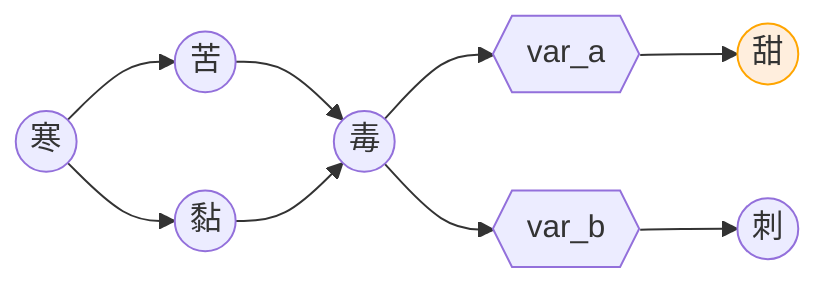

# 甜

作者：伊铭 2021年8月1日 

 [查看原文](https://weibo.com/6385011665/Krt14pZl0)

## 导言

本文为毒之后的时间线，如有ooc请多谅解。

本文七相视角，采用游戏的对话模式

## 编辑的话

第一段结尾，七相的大胆一次，感觉应该是放在心里说出的，这样会比较合理。

第三段的 “脑子中” 还行。。可能需要改。

第四段 “涨大了嘴” 算是错别字，不过某种角度来说也有点喜剧效果。

## 一

  【场景：七相家】

时光荏苒。

  关于焦雨的那件事已经告一段落， 年年也渐渐从悲伤中走了出来。

我想，我应该开始新的生活了，只不过，那天我举着枪的画面，仿佛就在眼前。

哎…现在也只能希望我当时做的是最合适的选择了。

  说起来，我是什么时候变得这么优柔寡断的呢？是从被焦雨抛弃的时候？还是和凌子分开的时候？不过，现在这些已经不重要了，因为我现在能做的，就是好好考虑当下啊。

凌子：“小七在想什么呢？”

凌子突然的出现吓了我一跳。

七相："啊！我在想……额……”

还是不把想的事情告诉凌子好了，我不想让他担心我。

该怎么转移话题呢……我转头看向了窗外。

七相：“我在想……就是那个我们之前一起经常去的那个咖啡馆。对，就是我家附近的那间咖啡馆。我之前还和老板说好要经常去的，结果因为种种事情耽搁了。”

凌子：“啊，那家咖啡馆，也是我之前和小七熟识的地方呢。自从被调到这里后，我也就一直没去过了。

七相：“嗯……”

凌子突然将爪子放到我的肩膀上。

凌子：“既然这样，那我们现在就去吧！”

我愣了一下。

七相：“什么？不用准备一下吗？”

凌子：“喝咖啡还要准备什么？小七，快走啦。”

  【凌子跑出房间】

  我笑了，凌子这家伙，真是一点也没变呢。

我正准备跟着凌子出去。我刚刚迈出脚，突然想起了凌子的工作服。

我打开衣柜，拿出了自己珍藏已久的衣服。

我闻了闻上面的气味，还是那股熟悉的味道，那种，像太阳晒过的棉被一样的味道，依旧温暖着我的心灵。

说起来，我一直都没有明确地接受凌子的表白。我也很喜欢他，只不过.. 我害怕最终会像焦雨一样突然的分开。

之前好不容易决定接受，最终却发现只不过是个梦。

  但是，我今天决定说出自己心里一直想要说的话。未来虽然不知道会发生什么，但不管怎样，不试试怎么知道会不会成功？

七相：“今天，就让我大胆一次吧！”

  我把衣服放进包中，慢慢地走出了房间。

## 二

【场景：咖啡馆】

老板：“七相，凌子，你们来啦。”

不管过了多久， 老板还是一下子认出了我们。

七相：“老板好啊，我说过我会经常来的……额啊？”

  我被眼前的景象震撼到了。咖啡馆的人虽然不是很多，但与之前相比，生意已经好了许多。至少，不用担心关店了。

老板：“自从你们走后，这附近建了一个地铁站，所以现在来咖啡店的人也多了起来。”

凌子：“恭喜啊老板。我来之后，这家店的运气都因此而变好了呢。”

这家伙，还是那么欠揍啊。

老板：“哈哈。啊对了，你们俩现在怎么样了？”

凌子： "我和小七当然是……”

我向凌子使了一个眼神，希望他不要将我们之间恋人的关系告诉老板。

凌子也是很配合，一下子就明白了我的用意。

凌子：“舍友关系啦。我经常到小七家玩。”

老板：“嗷嗷，是这样啊。哎呀，别光说话，坐下来喝杯咖啡吧。”

老板领着我和凌子坐了下来。

老板：“七相，还是来杯冰的吗？凌子，你要喝什么？”

凌子：“小七喝什么我就喝什么！凌子一脸期待地望着我。”

  嘿嘿，我这次可是有备而来。这次来咖啡馆，就是为了给他一个惊喜。

  七相： "就和往常一样吧。”

老板：“好的，两位需要等一等， 毕竟生意比之前忙碌得多。”

老板转身离开，我抓住了老板。

七相：“来了这么多次，我却还不知道咖啡馆内部长什么样子呢。带我参观参观吧，老板？”

老板：“当然可以啊，我带你去。”

老板准备领着我到咖啡馆内部去。

凌子：“等一下！我也要和七相一起去。”

七相：“哎呀，你就别去了，你之前是这里的员工，应该比我更熟悉这里。”

凌子闷闷地坐回了座位。而我则跟着老板走进了咖啡馆的内部。

## 三

【场景：咖啡馆内部】

  我随着老板走进了咖啡馆内部。虽然我不知道这里之前的样子，但我相信一定比以前整洁多了。

七相：“其实我这次来，是想给凌子一个惊喜。”

老板：“什么惊喜？”

七相：“我……我想穿着他之前穿过的工作服并亲手为他泡咖啡。所以老板，你可以教我泡咖啡吗？”

老板：“当然可以啊。你想要泡哪种咖啡？”

脑子中一下子想到了那次的米青咖啡。不行不行，我可不是这样的兽。说起来，我还不知道他喜欢喝什么。

七相：“那就……那就泡摩卡吧。”

老板拿出了冰箱里的淡奶油。

老板：“先把巧克力酱挤入咖啡杯中。”

我接过了巧克力酱。开始泡摩卡。呼，好险，差点挤出去了。

老板：“然后你把咖啡和热水调匀后加入到咖啡杯中，并用搅拌棒充分的搅拌均匀。”

这步还挺简单。

老板：“淡奶油要加入总量百分之二十的白砂糖打发，裱花带装上菊花花嘴。”

百分之二十是要放多少啊，算了差不多放一点就行了。

老板：“接下来这步，嗯……可能有点难，我来帮你吧。“

老板握着我的手，按照的螺旋的方向挤花在咖啡上。

老板：“最后筛上可可粉就行了。”

呼，终于完成了。

七相：“谢谢你啊老板。”

老板：“不用谢，快端给凌子吧。”

## 四

【场景：咖啡馆】

在端着咖啡出去之前，我掏出了藏在包里的工作服。

我迅速地穿上，端着咖啡走了出去。

  凌子看到了我，正准备打招呼的时候看到了我身上的工作服。

  凌子惊讶地涨大了嘴。

  过了好久，凌子缓缓地开了口。

凌子：“这件工作服…你居然还留着！”

七相：“这衣服可是我一直珍藏的宝贝呢。 啊对了，快尝尝我喝的咖啡。”

凌子慢慢地尝了一口。

凌子：“这是我喝过的最好喝的咖啡！咖啡里……有小七的味道！”

凌子端起咖啡，闭上眼睛，享受着咖啡的味道。

老板端着冰咖啡走了出来。

老板：“七相，你也尝尝吧。”

我喝这固定不变的冰咖啡。而咖啡的味道似乎发生了变化，不再是以前的苦涩，甚至……还有点甜？

  这股甜味，让我又想起了那个梦。

  凌子：“哟，小七，还在喝冰的啊。”

  等等！凌子现在不是在喝摩卡吗？那这声音是？

  这句话，在我的梦中也出现过。

  是啊，现在这美好的情景，简直和梦中的场景一模一样。

  借着这个机会，我也终于可以，大胆地说出那句埋在我心里的话。

“我爱你，凌子。”

完