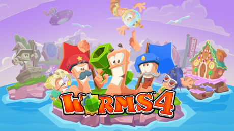

百战天虫系列游戏（Worms）由 Team17 开发。

[资源下载区](res/)

## 最新

### Worms Rumble

{:display="right"}



全新大逃杀玩法百战天虫已上线！

支持最多3人组队、32人对战的跨平台即时战略。

[Steam购买](https://store.steampowered.com/app/1186040) \| 62元 \| 史低46元

### Worms W.M.D

{:display="right"}



支持本地多人合作、对战、人机对战；

支持联机多人合作、对战；

支持最多6个队伍、支持中文界面，部分普通话配音由**神奇陆夫人、女流66**完成。

支持Steam云存档。

\*若购买 Switch 版本，将不能与 Windows 玩家联机。

| [Steam购买](https://store.steampowered.com/app/327030) | 发售             | 2020.7.10起     |
| ------------------------------------------------------------ | ---------------- | --------------- |
| 原价                                                         | 129              | 118             |
| 最低折价                                                     | 32 （25折） | 23 （2折） |

[《百战天虫：战争武器》百科页面](wmd/)

### Worms 4

{:display="right"}



支持最多2个队伍，本地和联机对战。

支持Facebook帐号登录后云同步存档。

[《百战天虫4》百科页面](4/) \| [App Store](https://apps.apple.com/cn/app/worms-4/id981535263)

## 热度不减

### Worms Armageddon

{:display="right"}

\*联机游戏时需要第三方工具。

[《百战天虫：末日浩劫》百科页面](armageddon/)

## 全部

### Android

|                                  | 中文 | 系统           | 日期              | 版本                  | Play                                                         |
| -------------------------------- | ---- | -------------- | ----------------- | --------------------- | ------------------------------------------------------------ |
| Worms 4                          |      | 2.3+ 4.1+ | - 2021.12.13 | 1.0.432182 2.0.6 | - [查看](https://play.google.com/store/apps/details?id=com.worms4.app) |
| Worms 3                          |      | 2.3+           | 2018.2            | 2.06                  | [查看](https://play.google.com/store/apps/details?id=com.worms3.app) |
| Worms 2 Armageddon |      | 2.2+           | 2014.1            | 1.4.0                 | [查看](https://play.google.com/store/apps/details?id=com.worms2armageddon.app) |
| Worms[^wnaea]                    | √    | 1.6+           | 2012.1            | 1.2.95                |                                                              |

[^wnaea]: 该版本与美国艺电合作完成。

### Java ME

详见 [资源下载区](res/)

[^datedisplay]: 显示的日期为游戏文件最新版的日期，而不是第一版本的发布日期。
[^w08touch]: 屏幕大小限制：180x320，否则显示位置与触摸位置可能会出现偏移。

### Windows

## 网上邻居

[我的虫时代](https://myworms.cn)

[百战天虫重装上阵中国组](https://steamcommunity.com/groups/worms_reloaded_cn)

[中国虫盟（镜像）](https://web.archive.org/web/20051126053446/http://bbs.cnworms.com/)

## 备注

